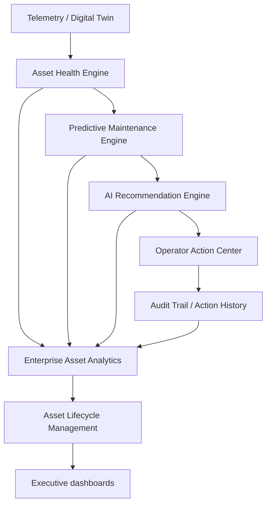

# Enterprise Asset Intelligence System Architecture

This document describes the architectural layout, data flows, and schema configurations of the **Enterprise Asset Intelligence Platform** (Phase 6) within the Grid Policy Orchestrator (GPO).

---

## 1. Architectural Overview

The Asset Intelligence module operates as a core intelligence loop on top of physical grid telemetry, digital twin simulations, and operator dispatches.

---

## 2. Core Modules & Directories

### 2.1 Backend Services & Routers
- **`app/models/asset_models.py`**: Model declarations mapping `Asset`, `AssetHealth`, `AssetMaintenance`, `AssetAIInsight`, `AssetRecommendationHistory`, and `AssetLifecycle`.
- **`app/routers/assets.py`**: REST controllers supplying routes for asset registration, real-time health telemetry, failures forecasting, operator actions, and lifecycle cost summaries.
- **`app/routers/analytics.py`**: Analytics module aggregating cost savings, CO₂ reductions, and historical profiles.

### 2.2 Frontend Views (`src-frontend/src/routes/AssetIntelligence/`)
- **`AssetWorkspace.tsx`**: Asset catalog registry and interactive topological maps.
- **`AssetHealthDashboard.tsx`**: Health gauge panels, temperature, and efficiency curves.
- **`MaintenanceDashboard.tsx`**: Scheduler deck and failure probabilities breakdown.
- **`AssetAIRecommendationPanel.tsx`**: Embedded diagnostic component rendering failure explanations, spare parts suggestions, and operator approval/dismissal tools.
- **`AnalyticsCenter.tsx`**: Tabs displaying executive KPIs, historical trends, and audit logs.
- **`AssetLifecycleCenter.tsx`**: Lifecycle stages, fleet age, and benchmarking comparison charts.

---

## 3. Database Schema Blueprint

### 3.1 `asset_lifecycles` Table
- `asset_id`: unique foreign key referencing `assets.id` (Indexed).
- `stage`: Lifecycle stage string (e.g., In Service, Under Maintenance).
- `age`: Current asset operational lifetime (years).
- `remaining_useful_life`: RUL expectation value (years).
- `maintenance_cost`: Aggregated maintenance costs ($).
- `replacement_cost`: Replacement liability cost ($).
- `availability`: Aggregated availability index (%).
- `performance_benchmark`: Benchmark performance coefficient (0-100).
- `lifecycle_cost`: Aggregated cost ($).

### 3.2 `asset_ai_insights` Table
- `asset_id`: unique foreign key referencing `assets.id` (Indexed).
- `recommendation`: Advisory recommended action.
- `reasoning`: JSON containing explainable triggers (health, failure, operational impact).
- `root_cause`: Analytical root cause.
- `confidence_score`: Score index (0.0 to 1.0).

---

## 4. End-to-End Workflow Data Flow

1. **Digital Twin & Telemetry**: Updates health indicators (temperature, load, capacity) in the database.
2. **Health & Maintenance Engine**: Evaluates RUL expectations, failure timelines, and flags critical alarms.
3. **AI Recommendation Engine**: Consolidates telemetry, RUL indices, and history to formulate advisory recommendations, root causes, and spare part suggestions.
4. **Asset Analytics & Lifecycle**: Computes savings, CO₂ levels, downtime hours, and performance curves.
5. **Operator Interaction**: Operator audits findings inside the detail panel and confirms or dismisses recommendations.
